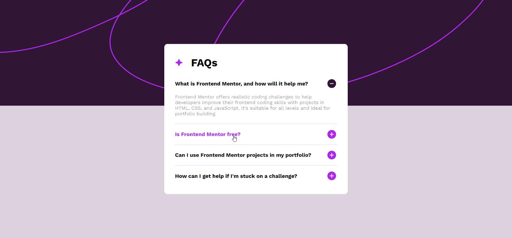

# FAQ accordion solution

This is a solution to the [FAQ accordion](https://www.frontendmentor.io/challenges/faq-accordion-wyfFdeBwBz).

## Table of contents

- [Overview](#overview)
  - [The challenge](#the-challenge)
  - [Screenshot](#screenshot)
  - [Links](#links)
- [My process](#my-process)
  - [Built with](#built-with)
  - [What I learned](#what-i-learned)
  - [Continued development](#continued-development)
- [Author](#author)

## Overview


### The challenge

Users should be able to:

- Hide/Show the answer to a question when the question is clicked
- Navigate the questions and hide/show answers using keyboard navigation alone
- View the optimal layout for the interface depending on their device's screen size
- See hover and focus states for all interactive elements on the page

### Screenshot

- Mobile view <br/> 


- Laptop view


- Active states


### Links

- Solution URL: [Frontend Mentor](https://www.frontendmentor.io/solutions/faq-accordion-with-reactjs-B2S9CeUo1A)
- Live Site URL: [Github](https://amrmabdelazeem.github.io/faq-accordion-main)

## My process

- Set up the project file locally.
- run ```npx create-react-app``` then ```npm start``` in local console to create the react app.
- Create the components, including Question component which will render each question as an individual component.
- Add the content of the HTML file into an array of objects to access through the main app.
- Use ```map()``` to generate each question component
- Use hooks, internal styling and conditional rendering to control the answers.
- Implemented CSS media queries to make it responsive.
- Set the project to deploy on gh-pages.

### Built with

- Semantic HTML5 markup
- CSS custom properties
- Flexbox
- Mobile-first workflow
- Responsive design
- [React](https://reactjs.org/) - JS library

### What I learned

As per adding the navigation through the keyboard, ```tabIndex``` is very helpful setting the index of the first tab.

```html
<div className="question" tabIndex={0} onClick={handleClick}>
```

```js
document.addEventListener("keydown", (event)=>{
    if(event.key === 'Enter' || event.key === ' '){
        event.target.click();
    }
})
```

### Continued development

I would like to continue learning more about React, specifically how to make it performant and efficient in terms of memory usage.

## Author

- Website - [Github](https://github.com/amrmabdelazeem)
- Frontend Mentor - [@amrmabdelazeem](https://www.frontendmentor.io/profile/amrmabdelazeem)
